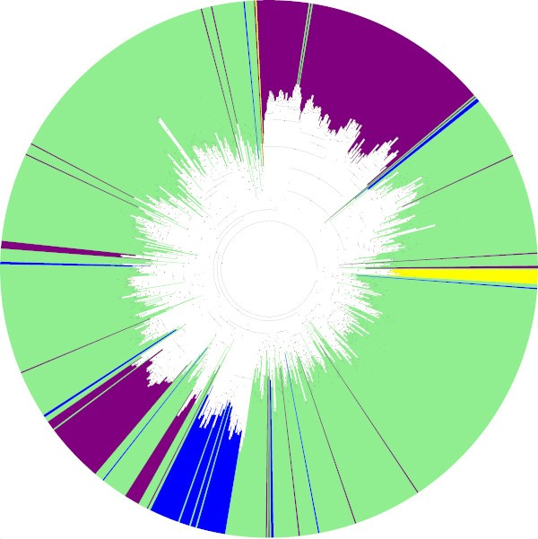
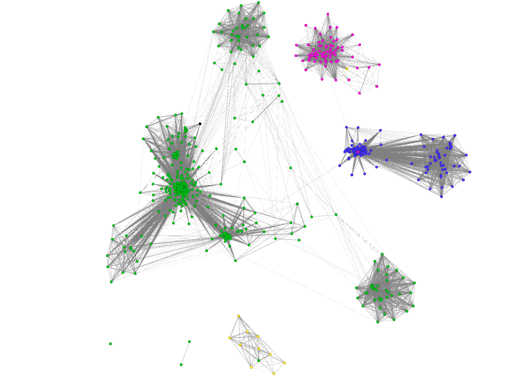

# Systematics and classification of plasmids
Supervisor:
Mikhail Rayko

Authors:
Ekaterina Vostokova (BI)
Pavel Vychik (BI)

## Aim
Our project aims to create an approach to classify newly sequenced plasmids, unrevealing their relation to currently known and characterized.

## Motivation 
Plasmids are extrachromosomal DNA molecules, predominantly circular, capable of autonomous replication. Although plasmids are an optional part of bacterial genomes, their acquisition by a cell can provide significant adaptive advantages due to the carrier of genes providing antibiotic resistance, the ability to utilize new substrates, and the expression of virulence factors, etc. Despite a large amount of data from various metagenomic projects and microbiome research, little is known today about plasmid's origin and no general approach for systematics of plasmids exists. We suggest the usage of two types of topologies derived from the phylogenetic tree build and a graph reconstruction to determine the relation of the plasmid of interest. Suggested topologies were built on the alignment of the Rep proteins involved in the replication process of the majority of the plasmid. 

## Materials and methods
The main source of data for plasmids proteins sequences was NCBI RefSeq plasmid proteins ([source](https://ftp.ncbi.nlm.nih.gov/refseq/release/plasmid/)), and additionally unpublished data from the supervisor were used.<br />
To identify Rep proteins PFAM hidden Markov models for [Rep_1](https://pfam.xfam.org/family/Rep_1), [Rep_2](https://pfam.xfam.org/family/Rep_2), [Rep_3](https://pfam.xfam.org/family/Rep_3), [Duff1424](https://pfam.xfam.org/family/PF07232) families were used.
Search for Rep-proteins was performed via hmmsearch from [HMMER](http://hmmer.org/publications.html). [Mafft v.7.453](https://mafft.cbrc.jp/alignment/software/) aligner tool and [FastTree](http://www.microbesonline.org/fasttree) were used for acquired Rep sequences alignment and further draft tree reconstruction.<br />
The step for tree reconstruction was automized with the script ```gettree.py``` (available in the repository). Usage options are provided below:
```
gettree.py <hmm file or folder with hmm models> <proteome fasta file> <temp folder> <output folder>
```
gettree.py requires the following tools to be installed and added to the system PATH environment (necessary to use subprocess call in python without full path to executables):
```
NCBI blast+ (makeblastdb and blastdbcmd utilities)
mafft
hmmsearch
FastTreeMP
```
Information about local blast+ install is available in official [manual](https://ftp.ncbi.nlm.nih.gov/blast/executables/blast+/LATEST/).



The tree was built using FastTree 2.1.11. Rep_1 (244) purple, Rep_2 (81) blue, Rep_3 (918) green, Duf1424 (12) yellow.
FastTreeMP results were reproduced on the same alignment with [IQtree](http://www.iqtree.org/) (tool for phylogenomic inference). The result showed consistency and are available in Newick format in the repo (output/iqtree/general_tree).

### Building graph with Gephi
1.The proteins were clustered at 50% similarity using MMseqs2 to decrease the number of proteins used (the next steps and building graph was also performed with no clustering and clustering at different similarities).
```
mmseqs easy-linclust input_proteins.fa clustered_proteins tmp --threads 4 --min-seq-id 0.95
```
2. Diamond was used to blast all sequences between one another. Parameter --ultra-sensitive was used to ensure the highest sensitivity possible.
A database was made from the proteins input file:
```
diamond makedb --threads 10 --in input_proteins.fa --db protein_database
```
And protein blast was done between each pair of proteins:
```
diamond blastp -d protein_database.dmnd -q input_proteins.fa  --ultra-sensitive -p 4 -k 0  -f 6 qseqid sseqid evalue qcovhsp pident bitscore 
```
3. Next diamond output and input in fasta format were converted to Pajek (.net) so that a graph could be built (using the python script diamond_to_pjk.py, provided by the project supervisor). The resulting file has a list of nodes and then edges with bitscore or transformed e-values as weights. Bitscore values were used as edge weights in this projects. 
4. Graph was visualized in Gephi 0.9.2.
The node is the protein, the edge is the blast hit of one protein on another. Graph was built several times with different algorithms. 

Graph built with Gephi 0.9.2 (OpenOrd algorithm). Rep1 is blue, Rep2 is purple, Rep3 is green and DUF is yellow. 

## Results
1. 5288 proteins with Rep-like domain were identified in NCBI GenBank plasmid proteome (over 1 500 000 non-redundant sequences) and supervisor’s sequencing data using HMM-models from Pfam
2. Clustering at 50% sequence identity level reduced data size to 1255 proteins, which were further used for graph building  (blast in diamond, Gephi)
3. Phylogenetic tree was built based on previously clustered data with FastTree
4. Acquired graph and tree topologies could be used for novel sequenced plasmids classification

## Conclusions
1. Rep-proteins contain only one type of rep-domain
2. Rep_3 family has the most members (918 proteins out of 1255 belong to Rep_3)
3. Tree and graph topologies demonstrate sub-groups existence within Rep_3 family 

## References
[1. Brooks L, Kaze M, Sistrom M. A Curated, Comprehensive Database of Plasmid Sequences. Microbiol Resour Announc. 2019;8:e01325-18.](https://journals.asm.org/doi/10.1128/MRA.01325-18)<br />
[2. Kirstahler P, Teudt F, Otani S, Aarestrup FM, Pamp SJ. A Peek into the Plasmidome of Global Sewage. mSystems. 2021;6:e00283-21.](https://journals.asm.org/doi/10.1128/mSystems.00283-21)<br />
[3. Shintani M, Sanchez ZK, Kimbara K. Genomics of microbial plasmids: classification and identification based on replication and transfer systems and host taxonomy. Front Microbiol. 2015;6.]( http://www.frontiersin.org/Evolutionary_and_Genomic_Microbiology/10.3389/fmicb.2015.00242/abstract)<br />
[4. Smillie C, Garcillán-Barcia MP, Francia MV, Rocha EPC, de la Cruz F. Mobility of Plasmids. Microbiol Mol Biol Rev. 2010;74:434–52.](https://journals.asm.org/doi/10.1128/MMBR.00020-10)<br />
[5. del Solar G, Giraldo R, Ruiz-Echevarría MJ, Espinosa M, Díaz-Orejas R. Replication and Control of Circular Bacterial Plasmids. Microbiol Mol Biol Rev. 1998;62:434–64.]( https://journals.asm.org/doi/10.1128/MMBR.62.2.434-464.1998)<br />

